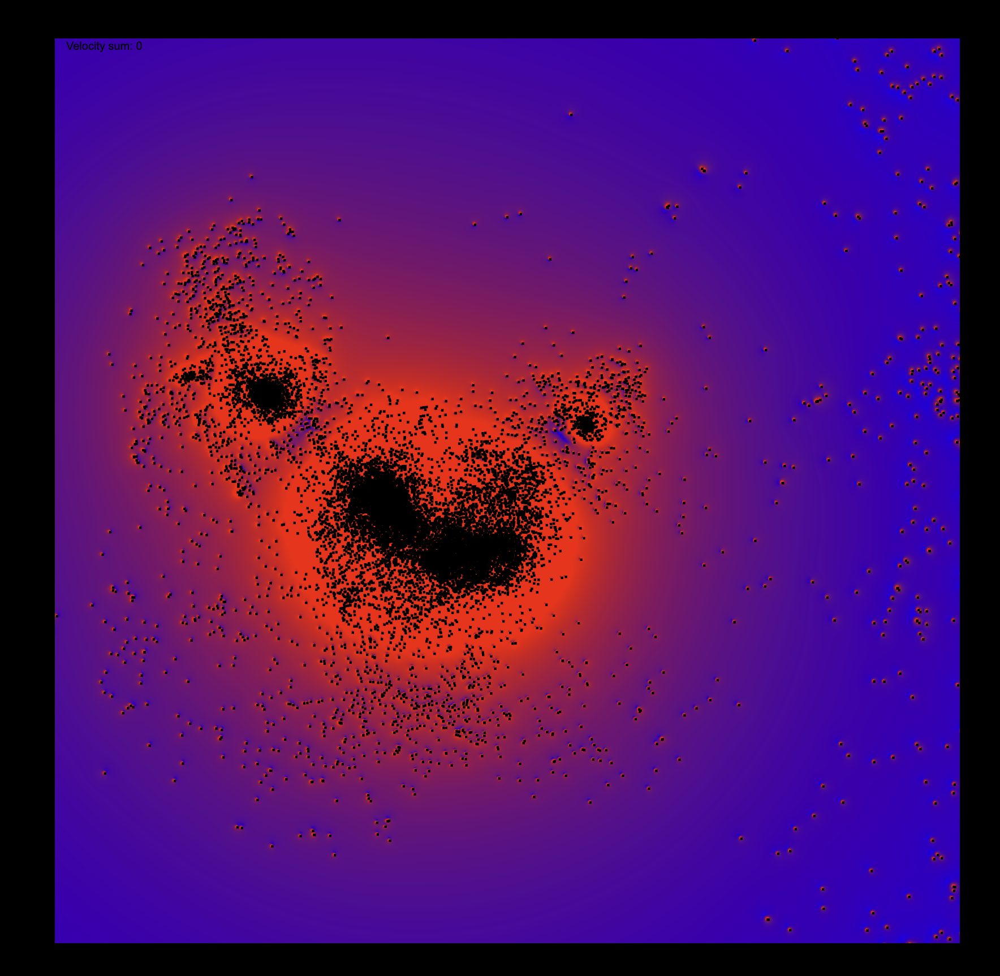

# Gravity Simulation

It's a project I've made out of curiosity for simulations. It's almost 38k challenge with the difference that i've written it in the mountains without any internet. Later when I had internet, I rewrote the computational engine to use gpu.js, because believe or not, the simulation of many points with mass and valocity can be very effectively parallelized using GPU. Below is chat gpt 4-generated readme to save my future self from guessing.



## Overview

This project implements a gravity simulation using JavaScript, leveraging the GPU.js library to accelerate computations. The simulation visualizes the gravitational interaction between particles, including the creation of galaxies and the forces acting upon each particle. It dynamically renders the result onto a HTML canvas element.

## Requirements

- A modern web browser with support for WebGL2.
- GPU.js library for GPU-accelerated computations.

## Features

- Realistic gravity simulation based on Newton's law of universal gravitation.
- GPU-accelerated computations for real-time performance.
- Dynamic scaling and rendering to adapt to various display resolutions and pixel ratios.
- Simulation of galaxies with customizable parameters for mass, center, radius, and number of particles.
- Interactive canvas display showing the movement and interaction of particles.

## Installation

1. Clone or download the project repository to your local machine.
2. Ensure you have a web server set up to serve the files. This can be a simple HTTP server or a more complex setup depending on your development environment.
3. Include the GPU.js library in your project. You can download it from [GPU.js GitHub repository](https://github.com/gpujs/gpu.js) or include it directly from a CDN in your HTML file:

   ```html
   <script src="https://cdn.jsdelivr.net/npm/gpu.js"></script>
   ```

4. Load the main script in your HTML file within the body tag, ensuring it runs after the DOM is fully loaded:

   ```html
   <script src="path/to/your/script.js"></script>
   ```

## Usage

Open the HTML file in a web browser to start the simulation. The simulation will automatically adapt to the size of the canvas element and the device's pixel ratio.

- **Particles**: Particles are initialized to form galaxies and are affected by the gravitational forces of other particles.
- **Galaxies**: You can customize the initial setup of galaxies by adjusting the parameters in the `initParticles` function.
- **Performance**: The simulation's performance depends on your device's GPU capabilities and the number of particles.

## Customization

You can customize the simulation by modifying the following parameters in the script:

- `G`: Gravitational constant. Adjust this to increase or decrease the strength of the gravitational force.
- `COMPUTE_BACKGROUND`: Set to `true` to dynamically compute the background based on gravitational forces or `false` to use a static background.
- `SCALE`, `PIXEL_SCALE`: Adjust these to change the simulation's scale and the size of the particles.
- Galaxy parameters in `initParticles`: Customize the mass, center, radius, and number of particles for each galaxy.

## Technical Details

- The simulation uses a WebGL2 backend through GPU.js for computations.
- Particles are represented as objects with properties for mass, position, velocity, and static status.
- The gravitational force between particles is calculated in a GPU-accelerated kernel, allowing for real-time interactions.
- The canvas is dynamically scaled to accommodate different device resolutions and pixel ratios.

## Acknowledgements

This project utilizes GPU.js, an open-source GPU accelerated JavaScript library.
